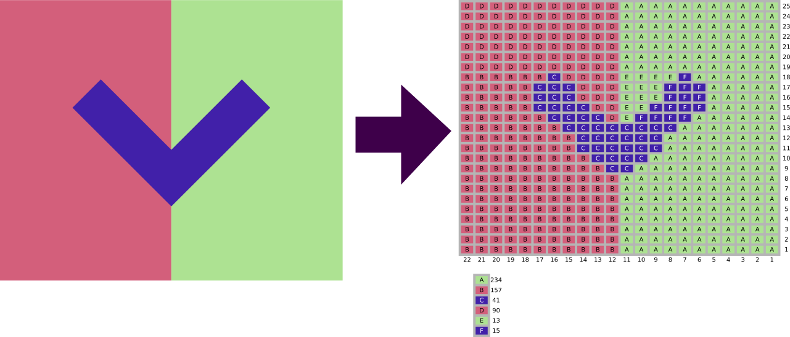

# Stitchify

A small utility to convert an image to an SVG knitting chart. It samples the image and scales it down to a specified number of stitches by picking the most frequent colour in the area covered by the stitch meaning that it never adds any colours that aren’t in the original image. The non-rectangular aspect ratio of the stitches is respected so that the piece can be knitted without stretching or shrinking the image on the piece. The stitches are grouped together into sections that can be knit with intarsia knitting and a stitch count for each section is shown in order to help create the bobbins.



## Basic usage

If you have a rust compiler installed, after checking out the repository you can build and run it like so:

```bash
cargo run -- -i your-image.png -o chart.svg
```

## Number of cast-on stitches

You can specify the number of stitches that you want to cast on with the `-s` option. By default this will be 22. The number of rows to knit will be calculated automatically based on the number of cast-on stitches and the aspect ratio of the source image.

## Gauge

If you want the image to be more precise you can specify your knitting gauge using the `--gauge-stitches` and `--gauge-rows` options. This would usually be the number stitches and rows in a 10cm×10cm square. The gauge is only used to calculate the aspect ratio of the box representing a stitch so in practice it doesn’t really matter what units you use for it.

## Garter stitch

If you are going to use the pattern to do garter stitch, you can specify the `-g` option. This will make it so that the generated chart will only change colour on odd rows. This is important for garter stitch because otherwise the colour change will look weird on the right side if the colour changes on even rows.

## Fair isle

If you are doing fair isle knitting then you don’t need the letters on the chart. You can remove them easily by opening the generated SVG in Inkscape. Press Ctrl+Shift+L to open the layers list, look for the group called “box-threads” and then delete it.

## Tweaking the image

If you want to tweak the colours in the generated image, you can do so by editing the colours of the boxes in Inkscape. If you then want to regenerate the stitch counts, one option could be to delete everything from the chart except the “boxes” group and then re-export it as a PNG. If you then rerun the program using this PNG it will recreate the diagram with the updated colours.
